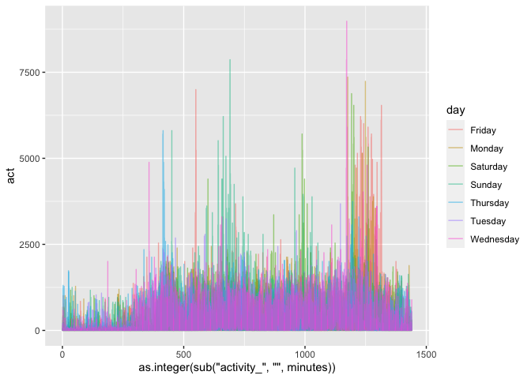
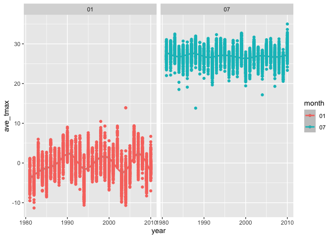
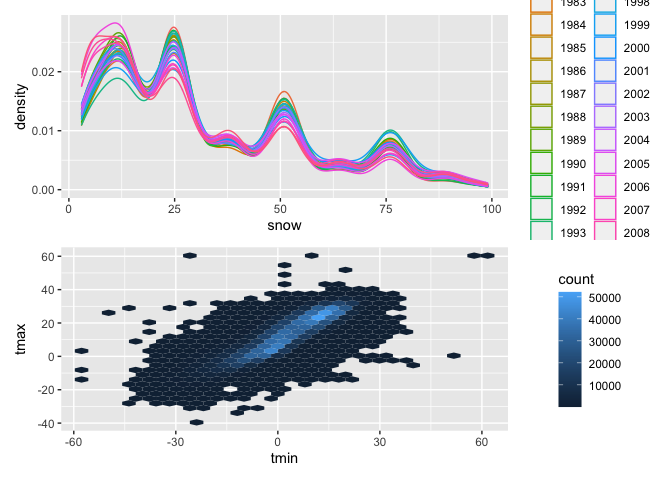

p8105_hw3_qs2260
================
Qingzhen Sun
2022-10-11

``` r
library(tidyverse)
```

    ## ── Attaching packages ─────────────────────────────────────── tidyverse 1.3.2 ──
    ## ✔ ggplot2 3.3.6      ✔ purrr   0.3.4 
    ## ✔ tibble  3.1.8      ✔ dplyr   1.0.10
    ## ✔ tidyr   1.2.1      ✔ stringr 1.4.1 
    ## ✔ readr   2.1.2      ✔ forcats 0.5.2 
    ## ── Conflicts ────────────────────────────────────────── tidyverse_conflicts() ──
    ## ✖ dplyr::filter() masks stats::filter()
    ## ✖ dplyr::lag()    masks stats::lag()

``` r
library(patchwork)
library(dplyr)
library(ggplot2)
library(ggridges)
library(p8105.datasets)
```

# problem 1

``` r
data("instacart")

instacart = 
  instacart %>% 
  as_tibble(instacart)
```

``` r
instacart %>% 
  count(aisle) %>% 
  arrange(desc(n))
```

    ## # A tibble: 134 × 2
    ##    aisle                              n
    ##    <chr>                          <int>
    ##  1 fresh vegetables              150609
    ##  2 fresh fruits                  150473
    ##  3 packaged vegetables fruits     78493
    ##  4 yogurt                         55240
    ##  5 packaged cheese                41699
    ##  6 water seltzer sparkling water  36617
    ##  7 milk                           32644
    ##  8 chips pretzels                 31269
    ##  9 soy lactosefree                26240
    ## 10 bread                          23635
    ## # … with 124 more rows

``` r
instacart %>% 
  count(aisle) %>% 
  filter(n > 10000) %>% 
  mutate(aisle = fct_reorder(aisle, n)) %>% 
  ggplot(aes(x = aisle, y = n)) + 
  geom_point() + 
  labs(title = "Number of items ordered in each aisle") +
  theme(axis.text.x = element_text(angle = 60, hjust = 1))
```

<!-- -->

``` r
instacart %>% 
  filter(aisle %in% c("baking ingredients", "dog food care", "packaged vegetables fruits")) %>%
  group_by(aisle) %>% 
  count(product_name) %>% 
  mutate(rank = min_rank(desc(n))) %>% 
  filter(rank < 4) %>% 
  arrange(desc(n)) %>%
  knitr::kable()
```

| aisle                      | product_name                                  |    n | rank |
|:---------------------------|:----------------------------------------------|-----:|-----:|
| packaged vegetables fruits | Organic Baby Spinach                          | 9784 |    1 |
| packaged vegetables fruits | Organic Raspberries                           | 5546 |    2 |
| packaged vegetables fruits | Organic Blueberries                           | 4966 |    3 |
| baking ingredients         | Light Brown Sugar                             |  499 |    1 |
| baking ingredients         | Pure Baking Soda                              |  387 |    2 |
| baking ingredients         | Cane Sugar                                    |  336 |    3 |
| dog food care              | Snack Sticks Chicken & Rice Recipe Dog Treats |   30 |    1 |
| dog food care              | Organix Chicken & Brown Rice Recipe           |   28 |    2 |
| dog food care              | Small Dog Biscuits                            |   26 |    3 |

``` r
instacart %>%
  filter(product_name %in% c("Pink Lady Apples", "Coffee Ice Cream")) %>%
  group_by(product_name, order_dow) %>%
  summarize(mean_hour = mean(order_hour_of_day)) %>%
  spread(key = order_dow, value = mean_hour) %>%
  knitr::kable(digits = 2)
```

    ## `summarise()` has grouped output by 'product_name'. You can override using the
    ## `.groups` argument.

| product_name     |     0 |     1 |     2 |     3 |     4 |     5 |     6 |
|:-----------------|------:|------:|------:|------:|------:|------:|------:|
| Coffee Ice Cream | 13.77 | 14.32 | 15.38 | 15.32 | 15.22 | 12.26 | 13.83 |
| Pink Lady Apples | 13.44 | 11.36 | 11.70 | 14.25 | 11.55 | 12.78 | 11.94 |

# Problem 2

Sum up 24 hour activity

``` r
tidy_acce = read_csv(file = "data/accel_data.csv")%>% 
  janitor::clean_names()%>%
  mutate(classify = ifelse((day == "Saturday"|day == "Sunday"),"weekend","weekday"))%>%
  mutate(total_act = rowSums(.[4:1443]))
```

    ## Rows: 35 Columns: 1443
    ## ── Column specification ────────────────────────────────────────────────────────
    ## Delimiter: ","
    ## chr    (1): day
    ## dbl (1442): week, day_id, activity.1, activity.2, activity.3, activity.4, ac...
    ## 
    ## ℹ Use `spec()` to retrieve the full column specification for this data.
    ## ℹ Specify the column types or set `show_col_types = FALSE` to quiet this message.

made up table and draw plot

``` r
tidy_df =tidy_acce %>% 
  select(week, day, classify, total_act)%>%
  arrange(total_act)
tidy_gf = tidy_acce %>%
  pivot_longer(activity_1:activity_1440,
               names_to = 'minutes',
               values_to = 'act') %>%
  ggplot(aes(x=as.integer(sub("activity_","",minutes)), y= act, color = day))+
  geom_line(alpha=0.5)

tidy_gf
```

<!-- -->
After cleaning the dataset, the tidy_acce table lefts 35 rows and 1445
columns, which contains 1443 varibles includes week, day_id, day and
1440 minutes activity.

The the table tidy_df shows the total activity of each day, which shows
that the week and day is not really related with total activity.

Based on the ggplot result, it can be concluded that the most higher
activity are mainly focus on 1200 minutes, and the lowest activity are
located at around 200 minutes.

# Problem 3

``` r
tidy_noaa = read_csv(file = "data/nynoaadat.csv")%>% 
  janitor::clean_names()%>%
  separate(date, into = c("year", "month", "day"))%>%
  mutate(prcp = prcp / 10 ,
    tmax = as.numeric(tmax) /10,
    tmin = as.numeric(tmin) /10,
    year = as.numeric(year),
    day = as.numeric(day))
```

    ## Rows: 2595176 Columns: 7
    ## ── Column specification ────────────────────────────────────────────────────────
    ## Delimiter: ","
    ## chr  (1): id
    ## dbl  (5): prcp, snow, snwd, tmax, tmin
    ## date (1): date
    ## 
    ## ℹ Use `spec()` to retrieve the full column specification for this data.
    ## ℹ Specify the column types or set `show_col_types = FALSE` to quiet this message.

``` r
names(which.max(table(tidy_noaa$snow)))
```

    ## [1] "0"

The most commonly observed value for snowfall is 0, since most of time
there’s not snow day which do not have snowfall.

``` r
tidy_mon = tidy_noaa%>%
  filter(month == c("01", "07"))%>%
  group_by(id, year, month)%>%
  summarize(ave_tmax = mean(tmax, na.rm=TRUE))%>%
  ggplot(aes(x=year, y=ave_tmax, color=month))+
  geom_point()+
  geom_smooth(alpha=0.5)+
  facet_grid(.~month)
```

    ## `summarise()` has grouped output by 'id', 'year'. You can override using the
    ## `.groups` argument.

``` r
tidy_mon
```

    ## `geom_smooth()` using method = 'gam' and formula 'y ~ s(x, bs = "cs")'

    ## Warning: Removed 5972 rows containing non-finite values (stat_smooth).

    ## Warning: Removed 5972 rows containing missing values (geom_point).

<!-- -->

Through the two-panel plot above, the temperature of july is higher than
january obviously. Also, the stability of july is better than january,
since the fluctuation of january id larger. On average, the max
temperature of july is about 25 degrees higher than january.

``` r
min_max=ggplot(tidy_noaa, aes(x=tmin, y=tmax))+geom_hex()

snowfall= tidy_noaa%>%
  filter(0< snow, snow<100)%>%
  mutate(year = as.factor(year))%>%
  ggplot(aes(x=snow, color=year))+
  geom_density()

snowfall/min_max
```

    ## Warning: Removed 1136276 rows containing non-finite values (stat_binhex).

<!-- -->
